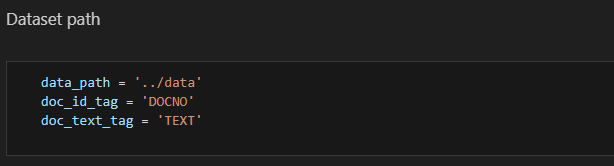

# Information Retrieval CSCE5200
This is a project for the Information Retrieval class, aimed at building a search engine to retrieve documents based on a user query.

## Installation
```bash
# Navigate to the project directory
cd information_retrieval_CSCE5200

# Install dependencies
pip install -r requirements.txt
```

## Token Extraction from Source Documents
The Jupyter notebook to iterate through the entire dataset and save the tokens and document IDs as a text file is available in notebooks/data_extraction.ipynb. Run all the cells in that notebook to save all the unique tokens to a text file.


## Creating Forward and Inverted Index
Open notebooks/index_construction.ipynb and run all the cells in that notebook to create forward index and inverted index.
* Forward index is constructed in the following format:

{
docID1: {wordIDi: freq in docID1; wordIdi+1: freq in docID1;...},
docID2: {wordIdj: freq in docID2; wordIdj+1: freq in docID2;...},
...
...
}


* Inverted index is constructed in the following format:
{
wordID1: {docId1: freq in docID1, docId2: freq in docID2,...},
wordID2: {docId10: freq in docID10, docId12: freq in docID12,...},
...
...
}

*To test this forward and inverted index construction on test data set, change the data_path to '../test_data'*
